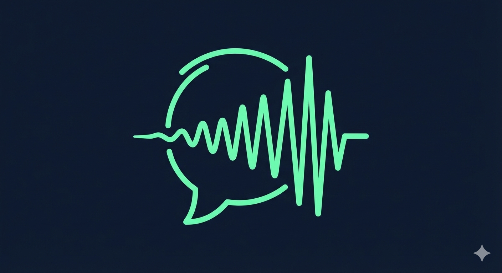

<p align="center">
  
</p>

<h1 align="center">Sludre</h1>
<p align="center">Windows desktop app for fast Danish speech-to-text on local CUDA, with optional LLM cleanup and direct cursor insertion.</p>

<p align="center">
  
  
  
  
</p>

## What Sludre Does
Sludre listens while you hold `Ctrl + Space`, transcribes locally with a Whisper-family model, optionally cleans the text with an LLM, and pastes the final result where your cursor is active.

## Core Features
- Global hold-to-talk hotkey: `Ctrl + Space`.
- Local STT with `syvai/hviske-v2` on CUDA via `faster-whisper`.
- Automatic model download to project-local `models/` (not AppData).
- Manual model path support.
- Automatic one-time conversion from Transformers Whisper format to CTranslate2 when needed.
- Optional LLM cleanup pipeline before insert.
- LLM providers:
  - OpenAI-compatible endpoint
  - Mistral API
- Named system prompt presets (create/update/delete and select in UI).
- Custom wordlist:
  - deterministic replacements
  - preferred term guidance in LLM prompt
- Output history log in UI:
  - raw transcription
  - final output
  - per-entry `Kopier` button
- Detailed runtime logging in both UI and file log.

## Requirements
- Windows 10 or 11
- NVIDIA GPU with working CUDA drivers
- Python 3.11+

## Quick Start
```powershell
python -m venv .venv
.venv\Scripts\Activate.ps1
python -m pip install --upgrade pip
pip install -r requirements.txt
python -m src.app
```

## Model Setup
By default, Sludre downloads from Hugging Face repo `syvai/hviske-v2` into:

`.\models\syvai--hviske-v2`

Download strategy:
1. Hugging Face CLI (`hf` / `huggingface-cli`) with heartbeat logging
2. Python SDK fallback (`huggingface_hub.snapshot_download`)

If the downloaded folder is Transformers Whisper format (`*.safetensors`), Sludre converts it once to CTranslate2 in:

`.\models\syvai--hviske-v2\ctranslate2`

### Manual Model Folder (if you download manually)
You can point Sludre to a manual folder in `Indstillinger`.

Supported folder types:
- CTranslate2-ready folder (must contain `model.bin`)
- Transformers Whisper folder (`config.json` + `model.safetensors` or `model-*.safetensors`)

If you use Transformers format manually, Sludre will auto-convert to CTranslate2 on first load.

## LLM Cleanup
LLM cleanup is optional and disabled by default.

Configurable in `Indstillinger`:
- provider
- API key
- model or preset
- timeout
- temperature
- system prompt preset

If LLM cleanup fails, Sludre prompts whether to insert raw transcription instead.

## Secret Storage
Sludre stores API keys in a project-local `.env` file:

`.\.env`

Keys used:
- `HF_TOKEN`
- `LLM_API_KEY`

Plaintext keys are no longer persisted in `config.json`.

## Wordlist
Default file:

`.\wordlist.json`

Use wordlist to:
- replace common STT mistakes with deterministic rules
- inject preferred terms into the LLM system prompt context

## Logs
- UI log panel for live events.
- File log at `.\logs\sludre.log`.
- Sensitive tokens are redacted from command logs.

## UI and Branding Assets
- Logo: `assets/sludre_logo.png`
- Background image: `assets/sludre_background_stick.png`

Sludre uses these assets directly in the app UI (logo card + toned background overlay).

## Development
Run tests:
```powershell
python -m unittest discover -s tests -p "test_*.py"
```

Compile check:
```powershell
python -m compileall src
```

## Project Structure
```text
src/
  app.py
  core/
  ui/
assets/
tests/
models/          # local model storage (ignored in git)
wordlist.json
```
